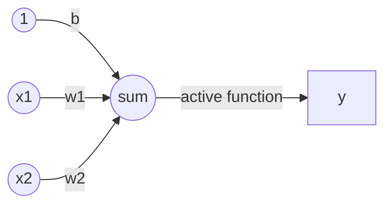

<h1>使用感知器实现逻辑与运算（and)</h1>

- 首先与运算定义如下：

| x1   | x2   | y    |
| ---- | ---- | ---- |
| 0    | 0    | 0    |
| 0    | 1    | 0    |
| 1    | 0    | 0    |
| 1    | 1    | 1    |

- 实现方法：	
  - 使用单个神经元（感知机）实现模型，并使用上表中的数据进行训练。
  - 感知机模型如下：

- 这里x1和x2对应上表中的x1和x2，激活函数如下：

$$
f(z) = \begin{cases}  
1, & z > 0 \\
0,& otherwise
\end{cases}
$$

- 具体的计算过程，$y=f(\vec w \vec x+b)=f(w1*x1+w2*x2+b)$.

- 模型训练方法:就是计算合适的$\vec w$和b的过程。

$w_i=w_i + \Delta w_i$这里$\Delta w_i=\eta(y-y')x_i$;这里面$y'$是感知器的输出值，而$y$是上表中样本的label。

$b=b+\Delta b$,这里$\Delta b = \eta (y-y')$.

- 每次从训练数据中取出一个样本的输入向量，使用感知器计算其输出，再根据上面的规则来调整权重。每处理一个样本就调整一次权重。经过多轮迭代后（即全部的训练数据被反复处理多轮），就可以训练出感知器的权重，使之实现目标函数。

  python代码如下：