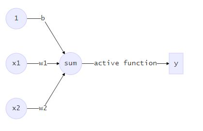
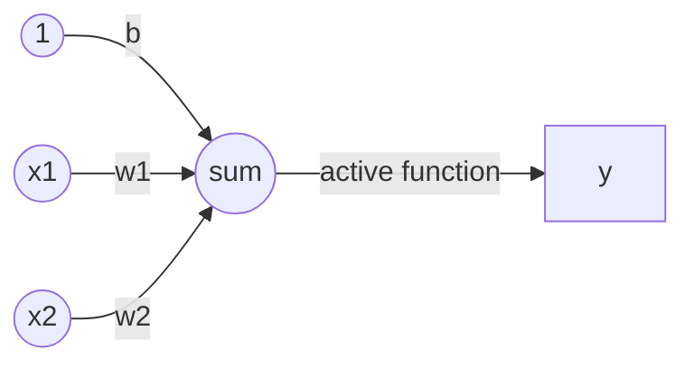

<center><h1>使用感知器实现逻辑与运算（and)</h1></center>

- 首先与运算定义如下：

| x1   | x2   | y    |
| ---- | ---- | ---- |
| 0    | 0    | 0    |
| 0    | 1    | 0    |
| 1    | 0    | 0    |
| 1    | 1    | 1    |

- 实现方法：	
  - 使用单个神经元（感知机）实现模型，并使用上表中的数据进行训练。
  - 感知机模型如下：





- 这里x1和x2对应上表中的x1和x2，激活函数如下：

$$
f(z) = \begin{cases}  
1, & z > 0 \\
0,& otherwise
\end{cases}
$$

- 具体的计算过程，$y=f(\vec w \vec x+b)=f(w1*x1+w2*x2+b)$.

- 模型训练方法:就是计算合适的$\vec w$和b的过程。

$w_i=w_i + \Delta w_i$这里$\Delta w_i=\eta(y-y')x_i$;这里面$y'$是感知器的输出值，而$y$是上表中样本的label。

$b=b+\Delta b$,这里$\Delta b = \eta (y-y')$.

- 每次从训练数据中取出一个样本的输入向量，使用感知器计算其输出，再根据上面的规则来调整权重。每处理一个样本就调整一次权重。经过多轮迭代后（即全部的训练数据被反复处理多轮），就可以训练出感知器的权重，使之实现目标函数。

  python代码如下：

```python
#  This program will complete the logic compute And
import numpy as np

class Perception:
    def __init__(self):
        self.w =  np.array([[0],[0]])
        self.b = 0


    def neuro(self, inputX):
        """single neuro cell
        
        [description]
        
        Arguments:
            inputX 2Dimension row vector -- as the input of perception
            return bool -- output after operation
        """ 
        if (np.dot(inputX, self.w) + self.b)[0] > 0:
            return 1
        else:
            return 0

    def train(self, inputX, labelY, rate=0.1):
        """train the model
            it will change the value of w and b
        Arguments:
            inputX 2Dimension row vector -- input of two operand
            labelY bool -- label of the sample inputX
        """
        outputY = self.neuro(inputX)
        self.w = self.w +  np.dot(rate*(labelY - outputY ),np.reshape(inputX,(2,-1)))
        self.b = self.b +  rate*(labelY - outputY)
            


perp = Perception()
stop=False
while stop == False:
    perp.train(np.array([0,0]), 0)
    perp.train(np.array([0,1]), 0)
    perp.train(np.array([1,0]), 0)
    perp.train(np.array([1,1]), 1)
    
    if perp.neuro(np.array([0,0])) == 0 and \
    perp.neuro(np.array([1,0])) == 0 and \
    perp.neuro(np.array([0,1])) == 0 and \
    perp.neuro(np.array([1,1])) == 1 :
        stop = True;

print('w = ' , perp.w)
print('b = %d' % perp.b)
print('0 and 0 = %d'% perp.neuro(np.array([0,0])))
print('1 and 0 = %d'%perp.neuro(np.array([1,0])))
print('0 and 1 = %d'%perp.neuro(np.array([0,1])))
print('1 and 1 = %d'%perp.neuro(np.array([1,1])))

```


- 参考文献
  - [零基础入门深度学习(1) - 感知器](<https://www.zybuluo.com/hanbingtao/note/433855>)